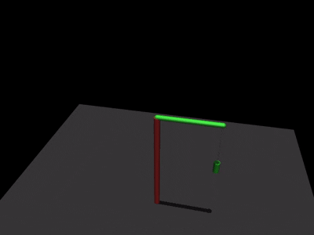
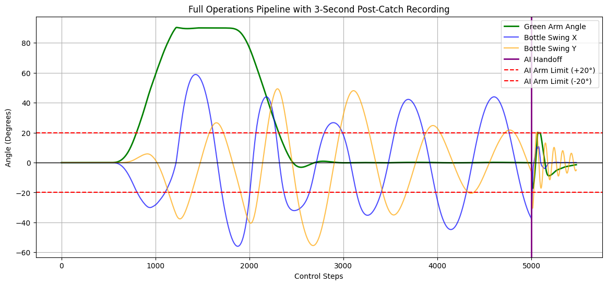

# SwingStop: RL-Powered Payload Stabilization 

> A Reinforcement Learning project utilizing Stable-Baselines3 and MuJoCo to train an AI agent in active kinetic damping and payload stabilization.


---

##  Project Overview

The objective of this project is to simulate a robotic crane arm that executes a high-momentum trajectory (a **"Fast Whip"** — 90° to the left and back) and seamlessly hands off control to a Reinforcement Learning (RL) agent.

The agent's mission is to **actively absorb chaotic kinetic energy** and stabilize a suspended payload (a bottle), using **restricted single-axis control (±20°)**.

> The key challenge is not just stabilization — but doing it under **severe physical constraints** and **non-resetting dynamics**.

---

##  Demo



---

##  Key Features

-  **Seamless AI Handoff Mechanism**  
  Physics-based scripted motion transitions directly into an RL environment **without resetting state**, transferring full kinetic momentum to the agent.

-  **Curriculum Training Strategy**  
  The PPO agent is trained in a **zero-damping vacuum** with randomized high-energy initial states to master extreme conditions.

-  **Active Damping Constraints**  
  The agent is limited to **±20° control**, forcing it to learn **precise micro-adjustments** instead of brute-force control.

-  **Telemetry Visualization**  
  Generates frame-accurate plots of the payload’s motion and the agent’s response using `matplotlib`.

---

##  Methodology & Experiments

The project progresses through three increasingly challenging setups:

### 1️⃣ Damped Environment (Proof of Concept)

- High environmental damping simplifies the physics.
- Demonstrates that PPO can learn stabilization under favorable conditions.

---

### 2️⃣ Undamped Vacuum (Training the "Master AI")

- All damping removed (**0.0 friction**).
- Agent trained for **1,000,000 timesteps**.
- Randomized high-energy initial velocities.
- Forces the agent to learn **true active damping**.

---

### 3️⃣ Full Pipeline Evaluation (Asymmetric Damping)

- X-axis damping = **0.0**
- Y-axis damping = **0.1**
- RL agent takes over immediately after the high-speed scripted motion.

---

##  Key Insight: The Single-Axis Limitation

The agent discovers a **physically optimal strategy**:

- It **cannot control the Y-axis** (perpendicular motion).
- Any attempt to correct Y will destabilize X.

 Therefore, the optimal policy becomes:
1. **Stabilize the X-axis perfectly**
2. **Stop moving completely**
3. Let natural physics resolve the Y-axis

This is a learned **control-theoretic behavior**, not explicitly programmed.

---

##  Telemetry Visualization



The graph shows the agent stabilizing X and then **freezing**, demonstrating its learned optimal policy.

---

##  Tech Stack

- **Simulation:** [MuJoCo](https://mujoco.org/) — Multi-body physics simulation
- **RL Framework:** [Stable-Baselines3](https://stable-baselines3.readthedocs.io/) — PPO algorithm
- **Environment API:** [Gymnasium](https://gymnasium.farama.org/)
- **Visualization:** `matplotlib`, `mediapy`

---

##  Installation & Usage

### 1️⃣ Clone the repository

```bash
git clone https://github.com/yourusername/SwingStop-RL.git
cd SwingStop-RL
```

### 2️⃣ Install dependencies

```bash
pip install mujoco mediapy stable-baselines3 gymnasium matplotlib
```

### 3️⃣ Run the notebook

Open:

```text
SwingStop RL-Powered Payload Stabilization.ipynb
```

Run all cells to:
- Train the model
- Simulate the environment
- Visualize results

---

##  Results

The final **Master AI model** achieves a **"Perfect Catch"** in extreme momentum scenarios.

✔ Seamlessly takes control after scripted motion  
✔ Stabilizes chaotic dynamics  
✔ Operates under strict physical constraints  

---

##  Contributing

Feel free to open issues or submit pull requests if you want to improve the project.

---

##  License

This project is open-source. Add a license if needed.

---

##  Author

Created as an exploration into **reinforcement learning, active damping, and continuous control robotics**.
